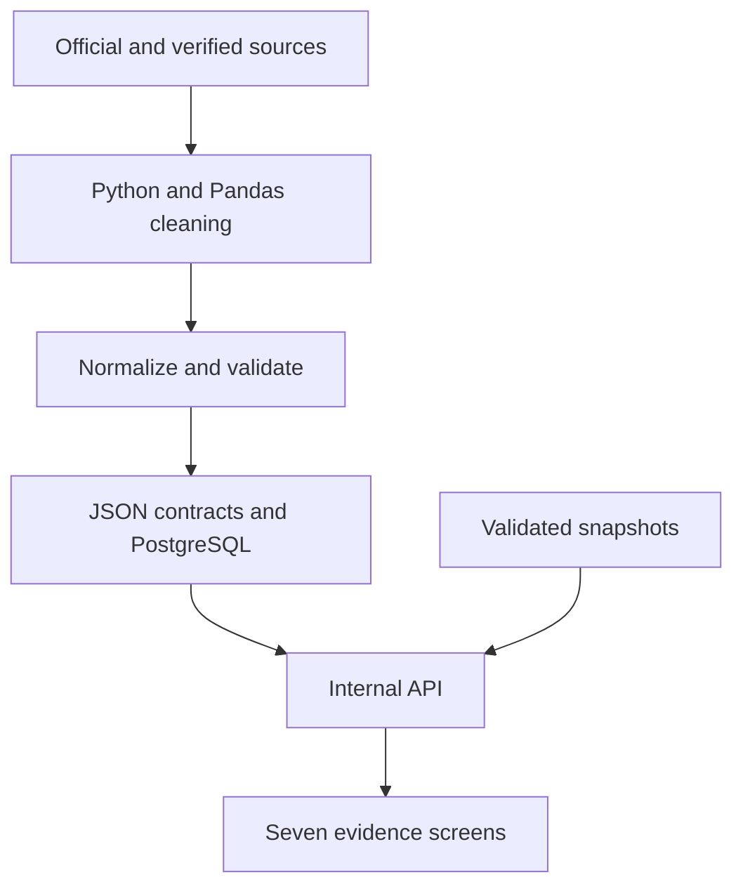

# FonioFlow Women-in-Data-2026-Datathon

## Purpose

FonioFlow is a decision-support prototype for exploring the evidence behind six connected barriers in the fonio value chain: production, processing, distribution, price, sourcing, and demand. It brings fragmented food-system data into one interface so that users can identify bottlenecks, compare markets, and see where evidence is strong or still incomplete.

This playbook explains how to use the application, interpret its results, reproduce its data workflow, and apply its findings responsibly.

**Live application:** [fonio-flow.vercel.app](https://fonio-flow.vercel.app)

## Intended users

- Farmers and cooperatives assessing production and market opportunities
- Buyers and retailers searching for fonio suppliers
- Processors identifying capacity and quality-information gaps
- Logistics planners comparing potential routes
- Policymakers and development organizations targeting interventions
- Researchers examining trade, availability, price, and demand evidence

## The six questions

| Screen | Decision question | Evidence examined |
|---|---|---|
| H1 Production | Is fonio supply sufficient and stable? | Production, harvested area, yield, country, and year |
| H2 Processing | Can processors meet buyer requirements? | Facilities, processing stages, product forms, capacity, certification, and quality information |
| H3 Distribution | Can fonio reach markets reliably? | Inland routes, distance, driving time, ports, connectivity, trade flows, and route risks |
| H4 Price | Is fonio commercially competitive? | Producer, retail, and trade prices compared with alternative grains |
| H5 Sourcing | Can buyers find reliable sellers? | Seller identity, products, markets, verification, delivery coverage, and wholesale availability |
| H6 Demand | Is demand and domestic availability understood? | Production, imports, exports, population, estimated availability, and consumer-survey findings |

## Five-minute demonstration
Here is the presentation slide link https://docs.google.com/presentation/d/13CCuTSXIVZRhe-rJsZtvH2wJ5cL7fyKwYJ8OhhpNQdA/edit?usp=sharing

1. **Start with Overview.** Introduce the farm-to-market question and explain that every result carries an evidence status.
2. **Open H1 Production.** Select a country and year, move the year control, and compare production, harvested area, and yield over time.
3. **Open H2 Processing.** Show the facility records and distinguish verified current capacity from planned or missing capacity information.
4. **Open H3 Distribution.** Compare inland distances and delivery times, then point out missing freight quotations and shipment-performance records.
5. **Open H4 Price.** Compare fonio with rice, millet, and quinoa, while noting whether each observation is verified and comparable.
6. **Open H5 Sourcing.** Search by market or product and demonstrate the separation between approved sellers and incomplete listings.
7. **Open H6 Demand.** Present domestic-availability indicators and the findings from 150 confirmed unique survey respondents.
8. **Return to Overview.** Summarize which hypotheses are supported, preliminary, or inconclusive and explain what evidence would change each conclusion.

## How to interpret the evidence

FonioFlow separates a research conclusion from the reliability of the data used to reach it. A hypothesis should not be accepted or rejected simply because a chart contains data.

Use the following checks:

1. **Status:** Was the response delivered from live, cached, or static data?
2. **Source:** Is the source official, directly verified, or secondary?
3. **Date:** Is the evidence current enough for the decision?
4. **Coverage:** Does it represent the relevant country, facility, route, seller, or population?
5. **Comparability:** Are the units, years, products, and market levels consistent?
6. **Missing data:** Could an absent variable materially change the conclusion?

### Data-delivery status

- `live` — retrieved successfully from an external provider during the request
- `cached` — returned from a previously validated provider response
- `static` — returned from a reviewed, date-stamped project snapshot
- `fallback active` — live retrieval failed and a validated alternative was returned

A live status indicates delivery method, not automatic analytical superiority. Official snapshots may be more appropriate when they have been reviewed for consistent definitions and coverage.

## Recommended decision workflow

### For buyers

1. Search H5 by product and destination market.
2. Review verification date, delivery coverage, and source link.
3. Compare the seller's origin with relevant H3 routes.
4. Check H4 price observations and confirm that product form and unit are comparable.
5. Request current stock, specification, certification, minimum order, price, and delivery terms directly from the seller before purchasing.

### For cooperatives and processors

1. Use H1 to understand national production trends.
2. Use H2 to identify missing capacity, certification, and product-form information.
3. Use H3 to assess access to ports and destination markets.
4. Use H5 to understand the information buyers need to locate and trust a supplier.
5. Maintain a verifiable business profile with current products, capacity, quality standards, contact details, and delivery coverage.

### For policymakers and development partners

1. Locate the bottleneck using the six hypothesis screens.
2. Distinguish structural gaps from missing evidence.
3. Prioritize interventions supported by traceable observations.
4. Collect the missing facility-, freight-, shipment-, and market-level evidence.
5. Reassess the hypothesis after new evidence is validated.

## Data workflow



The workflow follows five principles:

- Preserve the original source and reporting year.
- Standardize country names, dates, units, commodity codes, and missing values.
- Separate verified, planned, estimated, and unverified observations.
- Validate records against reusable application contracts before display.
- Keep reviewed snapshots available when external providers fail.

## Reproduce the project

### 1. Install and run

```bash
git clone https://github.com/aloroduns/FonioFlow.git
cd FonioFlow
npm install
npm run dev
```

Open `http://localhost:3000`.

### 2. Rebuild approved datasets

```bash
python scripts/export_data.py
```

Process a new CSV or Excel survey export with:

```bash
python scripts/process_survey.py INPUT.xlsx OUTPUT.json \
  --merge-app-json data/generated/h6-demand.json
```

Use `--unique-respondents-confirmed` only after the project owner confirms that each row represents a different individual.

QUESTIONNAIRE LINK
https://forms.gle/MSA7cFFVzDpHBtWN7

### 3. Validate before release

```bash
npm test
```

Review all generated changes, test every screen on desktop and mobile, and confirm that source status and missing-data warnings remain visible.

### 4. Deploy

Push the approved branch to GitHub and deploy it as a Next.js project on Vercel. Store database credentials, API keys, and administrator secrets in environment variables; never commit them to the repository.

Detailed setup instructions are available in [`docs/`](docs/).

## Maintaining the evidence

| Record type | Review action |
|---|---|
| Production, population, and trade | Refresh from the relevant provider; retain source timestamps and prior snapshots |
| Processing facilities | Confirm operating status, capacity basis, product forms, certification, and verification date |
| Routes | Recheck distance, time, border assumptions, freight quotations, and route date |
| Prices | Confirm currency, unit, package size, market level, product form, link, and access date |
| Sellers | Confirm identity, product availability, market coverage, source, and verification date |
| Survey findings | Preserve consent and anonymity; document sample size, cleaning decisions, and limitations |

## Responsible use and limitations

FonioFlow supports investigation and prioritization; it does not guarantee supplier performance, product availability, price, certification, freight cost, or delivery time.

- Do not treat missing evidence as proof that an activity does not exist.
- Do not present planned capacity as verified current output.
- Do not compare prices without aligning units, product forms, dates, and market levels.
- Do not publish personal survey information or confidential supplier communications.
- Reverify seller, route, and price information before making operational or financial decisions.
- Keep inconclusive hypotheses open until sufficient direct evidence is available.

## Priority next steps

1. Add current processor output and utilization data.
2. Collect comparable freight quotations for priority routes.
3. Add site-specific storage, road-access, delivery, and loss records.
4. Establish a recurring seller-verification process.
5. Expand consumer and buyer research across additional markets.
6. Automate scheduled provider refreshes with versioned audit history.
7. Extend the data contracts to other underutilized African grains.

## Expected impact

FonioFlow turns fragmented evidence into a traceable path from farm to market. It can help buyers discover credible suppliers, help cooperatives understand market requirements, and help development partners direct resources toward documented bottlenecks. With stronger facility- and shipment-level data, the platform can support better market access, more informed investment, and a more equitable and resilient fonio value chain.
