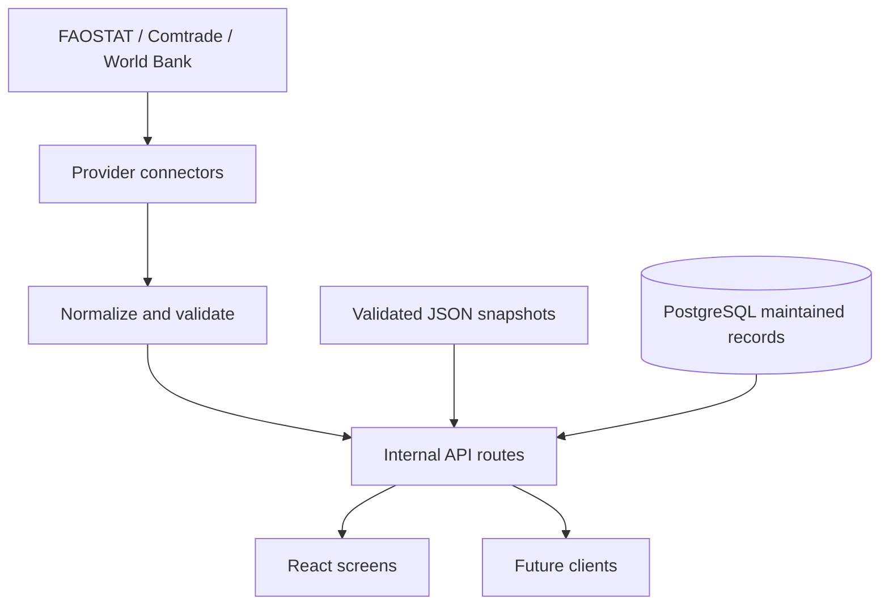

# FonioFlow data architecture

The internal API is the stable boundary. Screens never depend directly on provider response formats.

1. Provider requests use a timeout and normalize data to Zod contracts.
2. A successful response is tagged `live` and cached in memory.
3. Provider failure or rate limiting returns valid cache where available.
4. Without valid cache, the reviewed snapshot is returned and tagged `static` with a warning.
5. The interface translates metadata into **Live data**, **Validated snapshot**, or **Fallback active**.
6. Missing values remain visible and are never silently converted to facts.

Official analytical snapshots remain versioned in `data/generated`. Frequently maintained seller, verification, inquiry and demand records use the database schema in `database/schema.sql`.
